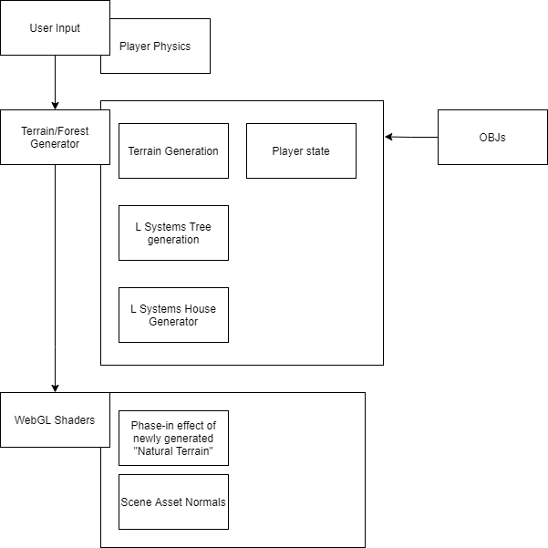

# Final Project!

This is it! The culmination of your procedural graphics experience this semester. For your final project, we'd like to give you the time and space to explore a topic of your choosing. You may choose any topic you please, so long as you vet the topic and scope with an instructor or TA. We've provided some suggestions below. The scope of your project should be roughly 1.5 homework assignments). To help structure your time, we're breaking down the project into 4 milestones:

## Design Doc

#### Project Motivation
- Di Lu and Serena Gandhi both share a deep love for Coraline (2009). We knew we wanted to incorporate the visual elements from the film, and while watching a "in the making" video of Coraline, stumbled upon the scene in which Coraline runs away (https://www.youtube.com/watch?v=91nfNp7MVIw) and noticed that it has great procedural graphics potential.

#### Goal
- In this project, Di and I intend to create a presentable and working project that will fit well on a demo reel. We also hope to deepen our understanding of the procedural pipeline as it applies to larger projects. Neither Di or Serena have worked on a project of this scope with so much freedom, so we are excited to learn from this process! 

#### Inspiration/reference:
- https://www.youtube.com/watch?v=91nfNp7MVIw
- 
- 
- 

#### Specification:
- In this project, Di and I intend to create a walking simulator in which the player can move around an intially fully-populated forest in the style of Coraline. The further from their spawn point they travel, the more sparse, cubist, and pixelated the scene becomes, just like in the scene from the movie. While diverging from the spawn point, trees will begin to look less natural, just as they do in the film. The forest and trees are all generated using instanced rendering and the terrain is generated as the player walks. Additionally, this project will incorporate procedural elements by altering the color palette or "season" and using randomness to generate and place the trees and assets in the forest. This project will require use of keyboard and mouse controls. As a bonus, we may also feature royalty-free music.

#### Techniques:
Here are the main technical/algorithmic tools we’ll be using:
- L-Systems (http://paulbourke.net/fractals/lsys/)
- Noise Functions (https://graphics.pixar.com/library/WaveletNoise/paper.pdf)
- Procedurally-generated realtime terrain creation (https://remptongames.com/2021/02/28/how-minecraft-generates-massive-virtual-worlds-from-scratch/)

#### Design:
- Here's how our program will fit together:

#### Timeline:
- 11/22: Di- OBJs, L-Systems Tree Generation, Terrain Generation; Serena- Player Physics, Player State,
- 11/29: Di and Serena- phase-in effect and incorporating player state with generation properties (by the end of this week, hopefully  have black sky and white terrain with structures, which will both exhibit desired behavior such as phasing in/out in a pixelated manner and becoming less natural). 
- 12/06: Di- add textures, polish OBJs, normals; Serena- flower assets, House generation (stretch)

## Milestone 2: Implementation part 1 (due 11/22)
### Current Progress:
Thus far, we have created an engine that the player can move around in using keyboard and mouse controls. We have set constraints that move the player back to spawn if they travel too far, and we also change the color of the sky and terrain as the player moves farther away from spawn.

### Trouble Makers:

### Example Images:

Begin implementing your engine! Don't worry too much about polish or parameter tuning -- this week is about getting together the bulk of your generator implemented. By the end of the week, even if your visuals are crude, the majority of your generator's functionality should be done.

Put all your code in your forked repository.

Submission: Add a new section to your README titled: Milestone #1, which should include
- written description of progress on your project goals. If you haven't hit all your goals, what's giving you trouble?
- Examples of your generators output so far
We'll check your repository for updates. No need to create a new pull request.
## Milestone 3: Implementation part 2 (due 11/29)
We're over halfway there! This week should be about fixing bugs and extending the core of your generator. Make sure by the end of this week _your generator works and is feature complete._ Any core engine features that don't make it in this week should be cut! Don't worry if you haven't managed to exactly hit your goals. We're more interested in seeing proof of your development effort than knowing your planned everything perfectly. 

Put all your code in your forked repository.

Submission: Add a new section to your README titled: Milestone #3, which should include
- written description of progress on your project goals. If you haven't hit all your goals, what did you have to cut and why? 
- Detailed output from your generator, images, video, etc.
We'll check your repository for updates. No need to create a new pull request.

Come to class on the due date with a WORKING COPY of your project. We'll be spending time in class critiquing and reviewing your work so far.

## Final submission (due 12/6)
Time to polish! Spend this last week of your project using your generator to produce beautiful output. Add textures, tune parameters, play with colors, play with camera animation. Take the feedback from class critques and use it to take your project to the next level.

Submission:
- Push all your code / files to your repository
- Come to class ready to present your finished project
- Update your README with two sections 
  - final results with images and a live demo if possible
  - post mortem: how did your project go overall? Did you accomplish your goals? Did you have to pivot?

## Topic Suggestions

### Create a generator in Houdini

### A CLASSIC 4K DEMO
- In the spirit of the demo scene, create an animation that fits into a 4k executable that runs in real-time. Feel free to take inspiration from the many existing demos. Focus on efficiency and elegance in your implementation.
- Example: 
  - [cdak by Quite & orange](https://www.youtube.com/watch?v=RCh3Q08HMfs&list=PLA5E2FF8E143DA58C)

### A RE-IMPLEMENTATION
- Take an academic paper or other pre-existing project and implement it, or a portion of it.
- Examples:
  - [2D Wavefunction Collapse Pokémon Town](https://gurtd.github.io/566-final-project/)
  - [3D Wavefunction Collapse Dungeon Generator](https://github.com/whaoran0718/3dDungeonGeneration)
  - [Reaction Diffusion](https://github.com/charlesliwang/Reaction-Diffusion)
  - [WebGL Erosion](https://github.com/LanLou123/Webgl-Erosion)
  - [Particle Waterfall](https://github.com/chloele33/particle-waterfall)
  - [Voxelized Bread](https://github.com/ChiantiYZY/566-final)

### A FORGERY
Taking inspiration from a particular natural phenomenon or distinctive set of visuals, implement a detailed, procedural recreation of that aesthetic. This includes modeling, texturing and object placement within your scene. Does not need to be real-time. Focus on detail and visual accuracy in your implementation.
- Examples:
  - [The Shrines](https://github.com/byumjin/The-Shrines)
  - [Watercolor Shader](https://github.com/gracelgilbert/watercolor-stylization)
  - [Sunset Beach](https://github.com/HanmingZhang/homework-final)
  - [Sky Whales](https://github.com/WanruZhao/CIS566FinalProject)
  - [Snail](https://www.shadertoy.com/view/ld3Gz2)
  - [Journey](https://www.shadertoy.com/view/ldlcRf)
  - [Big Hero 6 Wormhole](https://2.bp.blogspot.com/-R-6AN2cWjwg/VTyIzIQSQfI/AAAAAAAABLA/GC0yzzz4wHw/s1600/big-hero-6-disneyscreencaps.com-10092.jpg)

### A GAME LEVEL
- Like generations of game makers before us, create a game which generates an navigable environment (eg. a roguelike dungeon, platforms) and some sort of goal or conflict (eg. enemy agents to avoid or items to collect). Aim to create an experience that will challenge players and vary noticeably in different playthroughs, whether that means procedural dungeon generation, careful resource management or an interesting AI model. Focus on designing a system that is capable of generating complex challenges and goals.
- Examples:
  - [Rhythm-based Mario Platformer](https://github.com/sgalban/platformer-gen-2D)
  - [Pokémon Ice Puzzle Generator](https://github.com/jwang5675/Ice-Puzzle-Generator)
  - [Abstract Exploratory Game](https://github.com/MauKMu/procedural-final-project)
  - [Tiny Wings](https://github.com/irovira/TinyWings)
  - Spore
  - Dwarf Fortress
  - Minecraft
  - Rogue

### AN ANIMATED ENVIRONMENT / MUSIC VISUALIZER
- Create an environment full of interactive procedural animation. The goal of this project is to create an environment that feels responsive and alive. Whether or not animations are musically-driven, sound should be an important component. Focus on user interactions, motion design and experimental interfaces.
- Examples:
  - [The Darkside](https://github.com/morganherrmann/thedarkside)
  - [Music Visualizer](https://yuruwang.github.io/MusicVisualizer/)
  - [Abstract Mesh Animation](https://github.com/mgriley/cis566_finalproj)
  - [Panoramical](https://www.youtube.com/watch?v=gBTTMNFXHTk)
  - [Bound](https://www.youtube.com/watch?v=aE37l6RvF-c)

### YOUR OWN PROPOSAL
- You are of course welcome to propose your own topic . Regardless of what you choose, you and your team must research your topic and relevant techniques and come up with a detailed plan of execution. You will meet with some subset of the procedural staff before starting implementation for approval.
